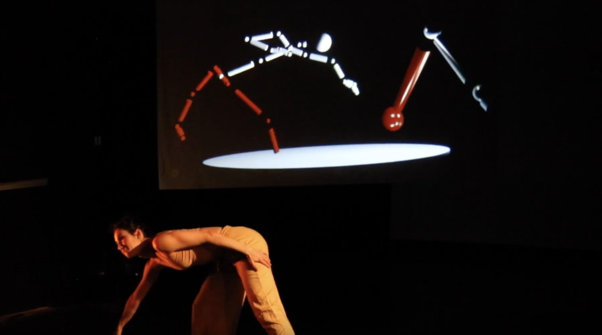
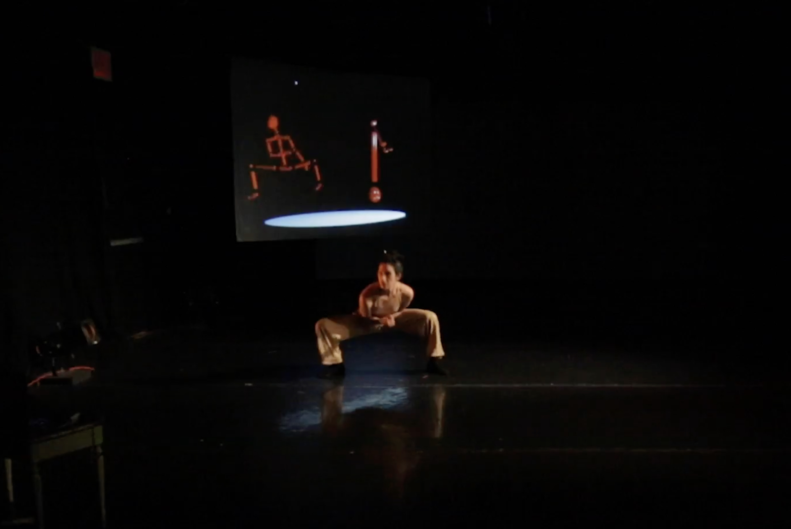
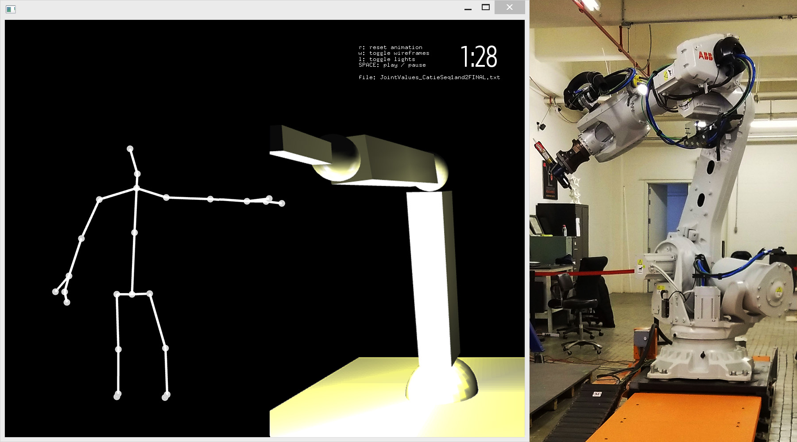

concat
======
A tool for visualizing robot movements alongside human movements. The concat system displays a depth skeleton from Kinect2 alongside a 3D rendering of data from an [ABB IRB 6700 industrial robot arm](https://new.abb.com/products/robotics/industrial-robots/irb-6700).

The depth skeleton can optionally be rendered as a 3D figure made of cylinders via a toggle (press 3 while Concat is running) for a more life-like presentation of the human figure.

Stills from video of Catie Cuan's performance with the concat tool. Video by Kevin Barry at ThoughtWorks.

This codebase was developed to support artist Catie Cuan as part of [her residency at ThoughtWorks Arts](https://thoughtworksarts.io/bio/catie-cuan/). It runs on openFrameworks and requires a KinectV2 depth sensor.

How to Set Up Concat to Play
=====
(Follow along with [this video](https://drive.google.com/file/d/1-pJ_z9HBJzf5vsvlahhrdF4FM1YstrKs/view?usp=sharing))

You will need: A Kinect V2, a Windows machine. Follow these steps after cloning the repository into your machine, and following the Installation instructions below. 

1. Testing the Kinect: This is a good first debugging step to ensure that your Kinect is working properly before trying to run the whole app. Open the SDK Browser v2.0 (Kinect for Windows).
Go to Samples: C++ >> Body Basics-D2D (at the bottom) and click Run
You should now arrange the Kinect until you see the dot-and-line skeleton on the screen. Then you can close the SDK.

1. Preparing the app:  Open Visual Studio 2017 and open concat.sln.
Make sure the app is in Debug and x64 bit mode. You should see a green button in the top bar that says Local Windows Debugger. Click on that to run the app.

1. Connecting app to Kinect: The app will now have opened in full screen. 
Click the `F` key to get out of full screen.
Now run the `BodyBasicsWPF` executable that you should  bookmark on the bottom of the Windows bar for easy access. This is the bridge that will allow the Kinect stream to go into the concat app. Another black screen should pop up, have someone move around in front of the Kinect until you see the skeleton in the app. 
Leave this app open, go back to the concat window and toggle the `F` key again to go back to full screen.

1. Making the figure 3D: Now you should see the skeleton on the screen of the app. Toggle the `3` key to turn it into 3D.
 
1. Starting and Stopping the dance sequence: Use the Space bar to start the choreographed moves. Space will also pause/play. 
Toggle the `R` key to restart.

Installation
=====
For now, concat must be run on Windows due to the dependencies of the Kinect V2. See dependencies below. You must

1. Install [openFrameworks](https://openframeworks.cc/download/) for Visual Studio 2017
1. Follow these steps to [setup Visual Studio](https://openframeworks.cc/setup/vs/) 
1. Add ofxOSC and ofxAnimatable to your addons from the dependencies below. Put the addon in the addons folder in your openFrameworks root folder.
1. Install [Kinect for Windows SDK](https://github.com/microcosm/KinectV2-OSC) following these instructions and test that you can run the executable. Follow the first instruction from [here](https://github.com/microcosm/ofxKinectV2-OSC) 
1. Clone this repo 

Project dependencies
--------------------
- [ofxOSC](https://github.com/openframeworks/openFrameworks/tree/master/addons/ofxOsc) (part of the openFrameworks core)
- [ofxKinectV2-OSC](https://github.com/microcosm/ofxKinectV2-OSC/commit/3d9bce120262f006cc11ae834c0cb22e510c1de3)
- [ofxAnimatable](https://github.com/armadillu/ofxAnimatable/commit/2fdb0773911525171dc7f782e855472bbf1bb1f2)
- Tested against [openFrameworks 0.10.0](http://openframeworks.cc/download/)
